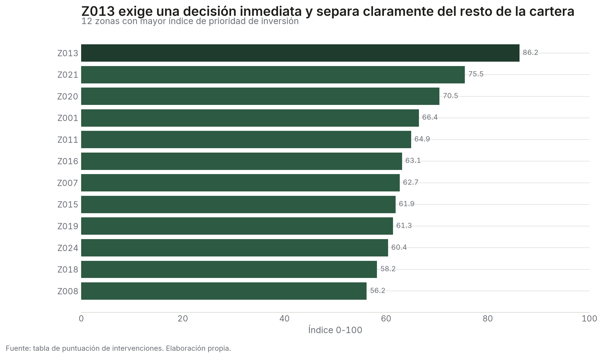
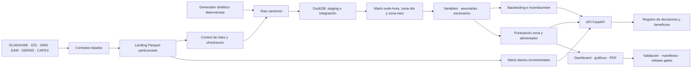

# Sistema de Inteligencia de Red para Electrificación Territorial

[](https://github.com/mfidalgomartins/sistema-inteligencia-red-electrificacion/actions/workflows/ci.yml)
[](pyproject.toml)
[](https://github.com/astral-sh/ruff)
[](Makefile)
[](LICENSE)

**Sistema reproducible de soporte a la decisión para priorizar, publicar y seguir intervenciones en redes de distribución bajo presión de electrificación.**

Convierte 4,8 millones de lecturas horarias de demanda en una cartera de intervención priorizada y trazable — dónde reforzar la red, dónde flexibilidad o almacenamiento bastan, y qué puede esperar — con cada cifra publicada respaldada por su propio contrato de validación.

**[Abrir tablero interactivo](https://mfidalgomartins.github.io/sistema-inteligencia-red-electrificacion/)** · **[Informe analítico PDF](https://mfidalgomartins.github.io/sistema-inteligencia-red-electrificacion/outputs/reports/informe_analitico_red_electrificacion.pdf)** · **[Caso de negocio](docs/caso_negocio.md)** · **[Arquitectura](docs/arquitectura_sistema.md)**



---

## Índice

- [Por qué existe](#por-qué-existe)
- [El sistema en cifras](#el-sistema-en-cifras)
- [Qué entrega](#qué-entrega)
- [Arquitectura](#arquitectura)
- [Ámbito de datos](#ámbito-de-datos)
- [Ejecución local](#ejecución-local)
- [Estructura](#estructura)
- [Metodología y contratos](#metodología-y-contratos)
- [Calidad](#calidad)
- [Artefactos públicos](#artefactos-públicos)
- [Hoja de ruta](#hoja-de-ruta)
- [Limitaciones](#limitaciones)
- [Stack](#stack)

---

## Por qué existe

Una red de distribución bajo presión de electrificación —vehículos eléctricos, industria, generación distribuida— no falla de forma homogénea: unas pocas zonas concentran la mayor parte del riesgo, mientras el capital para reforzarlas es limitado y secuencial. La pregunta que este sistema responde no es *si* invertir, sino **dónde, con qué palanca y en qué orden**, equilibrando seguridad operativa, integración de nueva demanda, eficiencia de CAPEX/OPEX y factibilidad de ejecución territorial.

La respuesta se entrega como una cartera de intervención por zona —refuerzo físico, flexibilidad, almacenamiento, operación avanzada o monitorización— secuenciada en horizontes de 0 a 24 meses y sometida a escenarios de estrés antes de comprometer capital. Detalle completo en el [caso de negocio](docs/caso_negocio.md).

## El sistema en cifras

Estado del último release reproducible (`make release`), extraído de `outputs/reports/release_manifest.json`:

| Cobertura analítica | Gobernanza del release |
|---|---|
| **24** zonas · **77** subestaciones · **274** alimentadores | Validación: **PASS** · confianza **alta** |
| **4.807.056** lecturas horarias de demanda | Estado de publicación: **publicable con matices** |
| Ventana `2024-01-01` → `2025-12-31` | Estado de decisión: **apto como soporte de decisión** |
| **15** contratos de fuente gobernados (SCADA/AMI, GIS, OMS, EAM, DERMS, CAPEX) | Estado de comité: **no apto para comité** (gap explícito, no maquillado) |

Estas cifras se regeneran en cada `make release`; el manifiesto es la fuente de verdad, no este README.

## Qué entrega

- Ranking de 24 zonas por riesgo técnico, impacto de servicio, exposición de activos, presión de electrificación y prioridad económica.
- Ranking trazable de 274 alimentadores que combina estrés local, exposición de activos y prioridad zonal.
- Recomendación entre refuerzo de red, flexibilidad, almacenamiento, sustitución de activos e intervención operativa.
- Comparación de ocho escenarios localizados de demanda, CAPEX, flexibilidad, generación distribuida y degradación de activos.
- Backtesting rolling-origin, selección de modelo, intervalos conformales al 80/95% y estado de deriva del pronóstico.
- Ingestión gobernada de 15 fuentes SCADA/AMI, GIS, OMS, EAM, DERMS, planificación y CAPEX, con lotes idempotentes y trazabilidad SHA-256.
- Marts diarios particionados, API FastAPI y registro auditable de decisiones y beneficios realizados.
- Tablero HTML autónomo, informe analítico en PDF y 19 gráficos de publicación.

## Arquitectura



Nueve capas con contrato de salida explícito —fuentes, ingestión, generación, persistencia analítica, incremental, modelado, decisión, ejecución, consumo, validación, publicación y trazabilidad— documentadas módulo a módulo en [arquitectura del sistema](docs/arquitectura_sistema.md). Decisiones de diseño relevantes: DuckDB concentra joins y agregaciones sobre 4,8 millones de observaciones sin infraestructura externa; los lotes externos son inmutables por `contract_name + batch_id`; el backtest reserva el último fold para intervalos conformales calibrados solo con folds previos; y el dashboard es HTML autónomo con Chart.js embebido, sin servidor.

## Ámbito de datos

El release de demostración es sintético y determinista: cubre 24 zonas y 4.807.056 observaciones de demanda horaria entre `2024-01-01 00:00` y `2025-12-31 23:00`. El modo externo conserva el mismo contrato analítico y sustituye el generador por inputs validados antes de ejecutar SQL, modelos y publicación.

## Ejecución local

Requiere Python 3.12.

```bash
make setup
make release
```

`make release` ejecuta el linter y las pruebas, reconstruye el flujo analítico, genera los artefactos públicos y aplica las puertas de calidad. Comandos individuales:

```bash
make check
make lint
make test
make coverage
make run
make publication
make validate
make smoke
make verify-publication
```

El flujo canónico, `python -m grid_intelligence`, ejecuta:

1. generación determinista o validación de fuentes externas;
2. reconstrucción de la capa SQL DuckDB;
3. variables analíticas, backtesting temporal, incertidumbre y detección de anomalías;
4. puntuación multicriterio de zonas y alimentadores;
5. escenarios, análisis, visualizaciones y tablero;
6. validación, manifiesto y puertas de publicación.

La instalación expone tres comandos:

- `grid-intelligence`: pipeline de release (`--source-mode synthetic|external`).
- `grid-intelligence-ops`: contratos, ingestión, promoción raw y refresco incremental.
- `grid-intelligence-api`: API analítica y ciclo de decisiones.

Ejemplo de lote diario SCADA/AMI:

```bash
grid-intelligence-ops ingest \
  --contract scada_ami_demanda \
  --input /ruta/gobernada/demanda_2025-02-01.parquet \
  --batch-id scada-20250201-r1 \
  --promote \
  --refresh-incremental
```

Para validar un snapshot externo completo y construir el release sin generar datos:

```bash
grid-intelligence-ops validate-external
grid-intelligence --source-mode external
```

La API exige `GRID_API_KEY` para crear o transicionar decisiones; los endpoints analíticos son de lectura:

```bash
grid-intelligence-api
```

Los datos en `data/raw` y `data/processed`, así como los diagnósticos técnicos en `outputs/reports`, son regenerables y no se versionan.

## Estructura

```text
src/grid_intelligence/  pipeline, ingestión, modelos, API y decisiones
sql/                    preparación, integración, marts, KPIs y validaciones
tests/                  contratos unitarios, analíticos y de publicación
docs/                   métricas, supuestos, arquitectura y gobernanza
notebooks/              lectura reproducible de artefactos procesados
outputs/graphs/         19 gráficos PNG para publicación
outputs/dashboard/      tablero HTML autónomo
outputs/reports/        informe analítico PDF
scripts/                gráficos, artefactos públicos y generador editorial del PDF
assets/fonts/           tipografías integradas y licencias de distribución
```

## Metodología y contratos

- Las horas de congestión zonales cuentan horas distintas con al menos un nodo congestionado.
- La carga punta zonal es el máximo horario de la demanda agregada de la zona.
- La demanda horaria ya incorpora vehículos eléctricos e industria; estos componentes no se suman de nuevo.
- La exposición de activos y todos los índices publicados están limitados a `0-100`.
- La confianza del pronóstico usa NMAE comparable entre zonas.
- Los intervalos de pronóstico se calibran solo con folds anteriores al fold de evaluación.
- Cada lote externo conserva checksum, ventana temporal, particiones y estado transaccional.
- Las decisiones usan transiciones explícitas y control de concurrencia por versión.
- La publicación se bloquea por fallos analíticos críticos o rankings de escenario indistinguibles.

Definiciones completas:

- [Caso de negocio](docs/caso_negocio.md)
- [Diccionario de datos](docs/data_dictionary.md)
- [Diccionario de variables analíticas](docs/feature_dictionary.md)
- [Supuestos económicos de referencia](docs/economic_assumptions.md)
- [Diseño del generador sintético](docs/generador_sintetico_diseno.md)
- [Arquitectura integral del sistema](docs/arquitectura_sistema.md)
- [Arquitectura SQL](docs/sql_architecture.md)
- [Definiciones de métricas SQL](docs/sql_metric_definitions.md)
- [Diccionario de métricas](docs/metric_dictionary.md)
- [Marco de puntuación](docs/scoring_framework.md)
- [Gobernanza y puertas de calidad](docs/governance_framework.md)
- [Operación de producción, API y recuperación](docs/operacion_produccion.md)

## Calidad

La garantía de calidad combina tres capas, todas ejecutadas en CI en cada `push`:

- **Calidad estática** (`make lint`, Ruff): lint, imports, modernización y formato canónico.
- **Pruebas de contrato** (`make test`): invariantes analíticos, ingestión idempotente, actualización incremental, incertidumbre, API, decisiones, SQL y publicación.
- **Cobertura integral** (`make coverage`): combina pruebas unitarias y ejecución completa del pipeline; el release falla por debajo del 80%.
- **Publicación** (`make release`): reconstruye los artefactos, actualiza el manifiesto y verifica hashes, estados y contratos públicos.

## Artefactos públicos

- [Tablero autónomo](outputs/dashboard/grid-electrification-command-center.html)
- [Informe analítico](outputs/reports/informe_analitico_red_electrificacion.pdf)
- [Gráficos de publicación](outputs/graphs/)

## Hoja de ruta

El manifiesto de release es honesto sobre lo que falta, no solo sobre lo que funciona. Extensiones previstas, en orden de dependencia:

1. **Conectar fuentes operativas reales** vía modo `external` — el contrato analítico ya es idéntico entre `synthetic` y `external`; falta el despliegue contra SCADA/AMI, GIS, OMS, EAM y DERMS de un operador concreto.
2. **Elevar el estado de comité** — el manifiesto declara hoy `committee_state: not committee-grade`; cerrar esa brecha exige ingeniería de detalle (flujo de carga, N-1, protecciones, permisos) y aprobación regulatoria, fuera del alcance analítico de este repositorio.
3. **Sustituir proxies económicos por costes reales** — coste de riesgo y CAPEX diferible son aproximaciones comparativas; su reemplazo por presupuesto de ingeniería requiere fuentes de coste gobernadas por el operador.
4. **Ampliar contratos de fuente** más allá de los 15 iniciales a medida que se incorporen nuevos sistemas operativos, sin romper el contrato analítico existente.

## Limitaciones

Los datos y costes son sintéticos. El sistema demuestra arquitectura analítica y priorización relativa, pero no sustituye estudios eléctricos detallados, calibración SCADA/AMI, evaluación regulatoria ni aprobación de inversión.

## Stack

Python, pandas, NumPy, DuckDB, FastAPI, Uvicorn, Matplotlib, ReportLab, Chart.js, pytest y Ruff.

## Licencia

[MIT](LICENSE)
