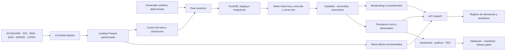

# Arquitectura del sistema

## Flujo canónico

## Responsabilidades

| Capa | Módulos | Contrato de salida |
|---|---|---|
| Fuentes | `ingestion/contracts.py`, `resources/source_contracts.json` | 15 contratos tipados, claves, límites y granularidad |
| Ingestión | `ingestion/service.py`, `operations_store.py` | landing Parquet, auditoría de lotes, checksums y promoción idempotente |
| Generación | `synthetic_generator/` | 15 tablas raw deterministas y controles de plausibilidad |
| Persistencia analítica | `src/sql_runner.py`, `sql/` | DuckDB, marts y vistas gobernadas |
| Incremental | `incremental.py` | particiones zona-día/alimentador-día y catálogo DuckDB |
| Modelado | `feature_engineering.py`, `forecasting.py`, `forecast_validation.py`, `anomaly_detection.py` | variables, rolling backtests, intervalos y anomalías |
| Decisión | `scoring.py`, `feeder_prioritization.py`, `scenario_engine.py` | rankings zonal/alimentador y escenarios localizados |
| Ejecución | `decision_tracking.py`, migración `002_decision_tracking.sql` | estados, eventos, versiones y realización de beneficios |
| Consumo | `api/` | API paginada y mutaciones autenticadas |
| Validación | `validation.py`, `quality_gates.py` | estado técnico, readiness y bloqueos de publicación |
| Publicación | `dashboard.py`, `visualization.py`, `scripts/build_publication_outputs.py`, `scripts/build_pdf_report.py` | HTML autónomo, 19 gráficos y PDF editorial reproducible |
| Trazabilidad | `release_manifest.py` | rutas, tamaños y SHA-256 de artefactos críticos |

## Decisiones de diseño

- DuckDB concentra joins, ventanas y agregaciones sobre 4,8 millones de observaciones sin requerir infraestructura externa.
- pandas se reserva para modelado local, reglas de decisión y composición de artefactos.
- La semilla y el horizonte pertenecen a `SyntheticDataConfig`; una ejecución completa reemplaza los outputs declarados de forma determinista.
- Los lotes externos son inmutables por `contract_name + batch_id`; un replay verifica checksum del origen y de cada partición.
- La actualización diaria usa el checksum agregado de sus inputs como watermark y admite reintento del mismo run fallido.
- El backtest respeta el orden temporal y reserva el último fold para evaluar intervalos conformales calibrados con folds previos.
- Las puntuaciones son lineales y acotadas a `0-100`; las reglas de intervención permanecen separadas de las ponderaciones.
- La API separa consultas read-only de mutaciones de decisión autenticadas y aplica paginación estable.
- El dashboard es un HTML autónomo con Chart.js embebido. No requiere servidor ni recursos externos.

## Sustitución por datos reales

El modo `external` valida el snapshot raw completo contra el catálogo antes de ejecutar el pipeline. Para cargas diarias, `grid-intelligence-ops ingest` confirma lotes en landing, registra su linaje y promueve una vista deduplicada a la interfaz raw. La lógica analítica posterior no cambia entre los modos `synthetic` y `external`.

## Operación y fallo

- `python -m grid_intelligence` registra inicio, fin y duración de cada etapa.
- Una excepción detiene el flujo en la etapa responsable; no se publica un estado exitoso parcial.
- DuckDB separa persistencia analítica, catálogo incremental y control operativo para evitar mezclar cargas con marts.
- Los cambios de estado de una decisión son transaccionales y append-only en `decision_events`.
- `make release` exige dependencias consistentes, lint, formato, compilación, cobertura mínima, reconstrucción, manifiesto y pruebas de publicación.
- Los artefactos regenerables no se versionan; el dashboard, el PDF y los gráficos públicos sí.
