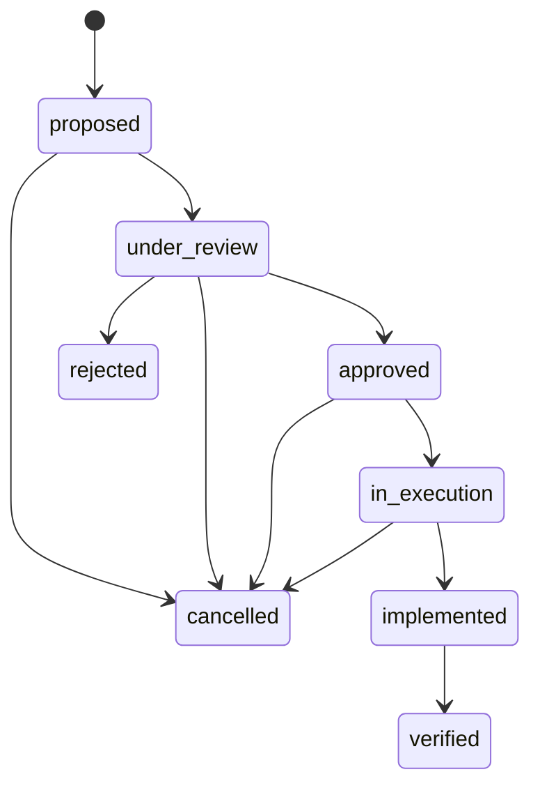

# Operación de producción

## 1. Interfaces operativas

| Interfaz | Responsabilidad |
|---|---|
| `grid-intelligence` | release analítico completo |
| `grid-intelligence-ops` | contratos, lotes, promoción raw y refresco incremental |
| `grid-intelligence-api` | consulta de marts y ciclo de decisiones |
| `make release` | gate reproducible de código, datos y publicación |

Las rutas de `data/landing`, `data/incremental` y `data/operational` son estado local regenerable y no se versionan. El código, las migraciones y los contratos sí se versionan.

## 2. Contratos de fuentes

| Contrato | Sistema | Tabla raw | Estrategia |
|---|---|---|---|
| `gis_zonas` | GIS | `zonas_red` | snapshot |
| `gis_subestaciones` | GIS | `subestaciones` | snapshot |
| `gis_alimentadores` | GIS | `alimentadores` | snapshot |
| `scada_ami_demanda` | SCADA/AMI | `demanda_horaria` | upsert |
| `scada_congestion` | SCADA | `eventos_congestion` | upsert |
| `der_generacion` | DERMS | `generacion_distribuida` | upsert |
| `planning_ev` | planificación | `demanda_ev` | upsert |
| `planning_industrial` | planificación | `demanda_electrificacion_industrial` | upsert |
| `planning_macro` | planificación | `escenario_macro` | upsert |
| `oms_interrupciones` | OMS | `interrupciones_servicio` | upsert |
| `operations_intervenciones` | OMS | `intervenciones_operativas` | snapshot |
| `eam_activos` | EAM | `activos_red` | snapshot |
| `derms_flexibilidad` | DERMS | `recursos_flexibilidad` | snapshot |
| `derms_almacenamiento` | DERMS | `almacenamiento_distribuido` | snapshot |
| `capex_inversiones` | CAPEX | `inversiones_posibles` | snapshot |

Consultar el esquema efectivo:

```bash
grid-intelligence-ops contracts
```

## 3. Carga diaria

1. Depositar el CSV o Parquet en una ruta gobernada de entrada.
2. Asignar un `batch-id` inmutable y trazable al origen.
3. Confirmar el lote, promover la vista raw y refrescar las fechas afectadas.
4. Ejecutar el pipeline externo cuando el snapshot raw completo esté listo.

```bash
grid-intelligence-ops ingest \
  --contract scada_ami_demanda \
  --input /ruta/gobernada/demanda_2025-02-01.parquet \
  --batch-id scada-20250201-r1 \
  --promote \
  --refresh-incremental

grid-intelligence-ops validate-external
grid-intelligence --source-mode external
```

Reenviar el mismo lote es seguro si el origen y sus particiones no cambiaron. El sistema rechaza el mismo `batch-id` con otro checksum y detecta particiones registradas ausentes o alteradas.

## 4. API

El proceso requiere `GRID_API_KEY` para mutaciones. `GRID_API_HOST`, `GRID_API_PORT` y `GRID_API_LOG_LEVEL` son opcionales. La especificación OpenAPI se sirve en `/openapi.json` y la interfaz técnica en `/docs`.

| Método | Ruta | Uso |
|---|---|---|
| GET | `/health` | disponibilidad de bases y artefactos |
| GET | `/v1/zones` | prioridad zonal paginada |
| GET | `/v1/feeders` | prioridad de alimentadores paginada |
| GET | `/v1/scenarios` | resumen de escenarios |
| GET | `/v1/forecast-monitoring` | deriva y cobertura del pronóstico |
| GET | `/v1/marts/zone-day` | mart zona-día filtrable |
| GET | `/v1/marts/zone-month` | mart zona-mes filtrable |
| GET/POST | `/v1/decisions` | consulta/alta idempotente de decisiones |
| POST | `/v1/decisions/{id}/transitions` | transición con versión esperada |
| GET | `/v1/decisions/{id}/events` | auditoría completa |
| GET | `/v1/decisions/metrics` | CAPEX y realización de beneficios |

Las mutaciones usan `X-API-Key`. Toda respuesta incorpora `X-Request-ID`; un identificador válido recibido se conserva para correlación de logs.

## 5. Ciclo de decisión



La transición a `verified` exige beneficio anual y reducción de riesgo observados. `expected_version` aplica control de concurrencia optimista y evita sobrescribir una decisión actualizada por otro actor.

## 6. Monitorización y recuperación

- `/health` debe responder `ok` antes de habilitar consumidores.
- `forecast_monitoring_status.csv` es la señal canónica de estabilidad, vigilancia o acción requerida.
- `completitud_datos` identifica días incompletos; el máximo esperado es `1.0`.
- Un refresco incremental `failed` puede reenviarse con la misma fecha y watermark; reutiliza el registro y limpia el error previo.
- Un refresco `running` para la misma fecha y watermark bloquea una ejecución concurrente.
- `make smoke` detecta artefactos vacíos, hashes obsoletos, contratos inválidos y publicación bloqueada.

Diagnóstico directo del control operativo:

```sql
SELECT contract_name, status, COUNT(*) AS lotes
FROM ingestion_batches
GROUP BY contract_name, status;

SELECT process_date, status, feeder_rows, zone_rows, error_message
FROM incremental_runs
ORDER BY started_at DESC;

SELECT status, COUNT(*) AS decisiones
FROM decisions
GROUP BY status;
```

## 7. Release

```bash
make release
```

El release solo termina si dependencias, lint, compilación, pruebas, cobertura, pipeline, publicación, hashes y smoke tests quedan en verde. Ante fallo no se debe publicar el manifiesto como válido; se corrige la etapa responsable y se repite el mismo comando.
